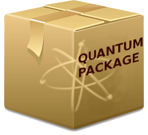

.. Quantum Package documentation master file, created by
   sphinx-quickstart on Thu Oct 18 11:53:23 2018.
   You can adapt this file completely to your liking, but it should at least
   contain the root `toctree` directive.

===============
Quantum Package
===============

.. toctree::
   :maxdepth: 1
   :caption: Introduction

   intro/intro
   intro/selected_ci
   intro/configure
   intro/install

.. toctree::
   :maxdepth: 1
   :caption: User's guide

   users_guide/users_guide
   users_guide/interfaces
   users_guide/qp_create_ezfio_from_xyz
   users_guide/qp_convert_output_to_ezfio
   users_guide/qp_edit
   users_guide/qp_run
   users_guide/qp_set_mo_class
   users_guide/natural_orbitals
   users_guide/plugins
   users_guide/excited_states
   users_guide/interfaces

.. toctree::
   :maxdepth: 1
   :caption: Modules
   :glob:

   modules/*

.. toctree::
   :maxdepth: 1
   :caption: Programmer's guide

   programmers_guide/programming

.. toctree::
   :maxdepth: 1
   :caption: Appendix

   appendix/benchmarks
   appendix/research
   appendix/license

